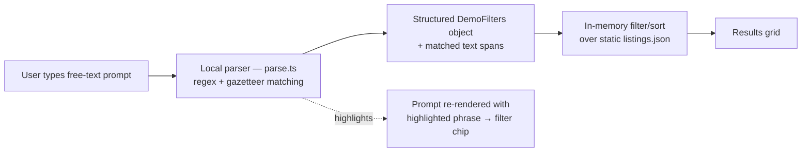
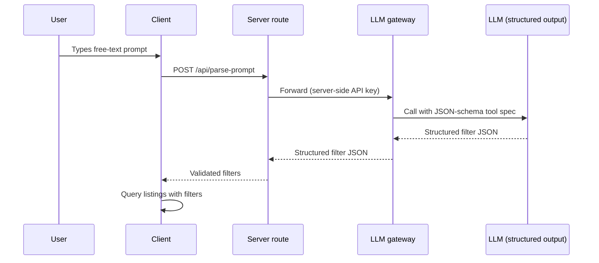

# Architecture

This demo has one interesting design decision in it: the natural-language parsing step is mocked, and that is deliberate. This document explains what actually runs here, what the production version of the same idea looks like, why the difference exists, and what it costs.

## What runs in this demo

Everything is client-side. There is no server, no database, no API call, no key. A prompt is parsed by `src/lib/parse.ts` — ordered regex patterns plus a gazetteer of the 26 counties and 194 towns that appear in the dataset — into a `DemoFilters` object and a set of character spans marking which words produced which filter. The filters run in memory against `src/data/listings.json`, which is generated at build time and bundled.

The spans are what make the parse visible: the UI re-renders the user's own prompt with each matched phrase highlighted and drawn to the chip it created. Patterns are applied most-specific-first and each match claims its character range, so a looser pattern can never re-read text an earlier one consumed — "detached garage" is taken by the outbuilding matcher before the property-type matcher can see "detached".

Same prompt in, same filters out, every time. Zero network calls in the parse path.

## What production would do

The real product replaces exactly one box in that diagram. The prompt goes to a server route, which forwards it to an LLM gateway holding the API key, which calls a model with a JSON-schema tool spec so the response is structured filters rather than prose. The server validates the returned JSON against the same `DemoFilters` shape and hands it back to the client.

The contract either side of the parsing step is unchanged: prompt in, validated `DemoFilters` out, same downstream search, same chip UI, same editable filters. That is the point of drawing the boundary there — the swap is one module, not a rewrite.

## Why the LLM call has to be server-side

Key custody. A static site has no private place to hold a secret. Anything supplied to client code at build time — including every `VITE_*` variable — is inlined into the JavaScript bundle and served verbatim to every visitor; "view source" is all it takes. A private repository changes nothing about this, because the bundle is public even when the source is not.

So a browser-side LLM call means either shipping a usable API key to anyone who loads the page, or proxying through a server. There is no third option. The server route exists to be the only thing that ever sees the key — it also gives you the natural place for rate limiting, request validation, and schema-checking the model's output before it reaches the client.

Since this demo is deployed as static files with no server, calling an LLM would mean shipping the key. That is not a trade-off worth making for a portfolio piece, so the demo does the honest thing instead: simulate the step, and say on the page that it is simulated.

## What the mock trades away

The regex-and-gazetteer parser is genuinely worse at language than a model would be:

- **Novel phrasing.** It matches patterns it was written for. "Somewhere I could put my mother-in-law up" means nothing to it; an LLM would map it to an outbuilding or a fourth bedroom.
- **Negation.** It handles a small number of explicit cases (`"BER doesn't matter"` is consumed so the band matcher never sees it). General negation — "not an apartment", "anywhere but Dublin" — is not something ordered regex does reliably.
- **Compound and conditional criteria.** "Three beds, or two if it has an outbuilding" has no representation in a flat filter object and no chance of being parsed correctly here.
- **Implicit reasoning.** "Good commute to Cork" requires knowledge the parser doesn't have.

What it gains is worth naming too: zero latency, zero per-query cost, zero network dependency, zero credentials to protect, and complete determinism — which is also what makes it unit-testable, so the parser's behaviour is pinned by tests rather than sampled from a model.

For a public demo that has to load fast, cost nothing to run, and stay up without supervision, that is the right side of the trade. In production, where a wrong parse loses a customer rather than a page view, it is not — hence the server-side design above.

## Deployment

`npm run build` typechecks and emits static files to `dist/`. GitHub Actions builds on push to `main` and publishes to GitHub Pages using the workflow's default `GITHUB_TOKEN` — there are no repository secrets, because there is nothing to keep secret. `base` in `vite.config.ts` is set to the Pages project sub-path so assets resolve correctly there.
